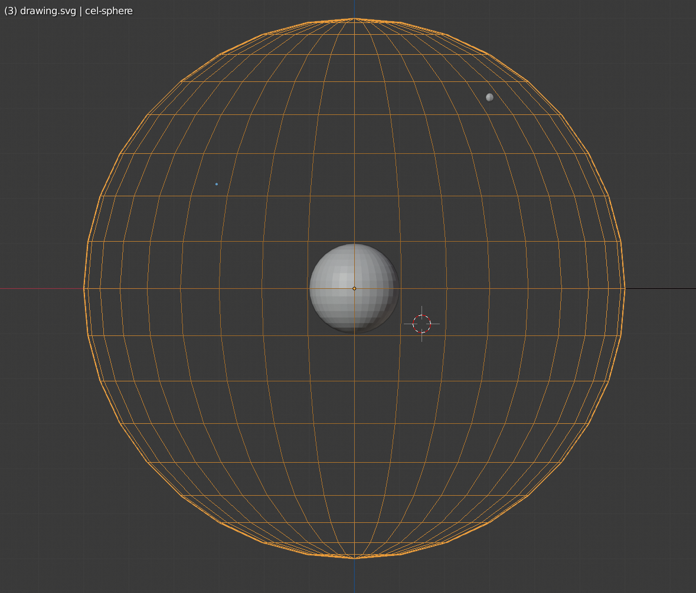

<h1>Blender Integration</h1>

If you have background in 3D animation, skip ahead to the setup steps.  If not, let me explain a little.

Blender has a back door you can enter with the Python programming language.  When you do, you'll discover that all Blender data is organized into Python data structures.  So if you complete the setup described here, you will be able to load a Blender file in a Hy repl and run with it.  Let me give an example of how this is useful:

  

To create the celestial coordinate system needed to accurately animate Starlink satellite orbits around the earth, I built the needed 3D geometries in Blender. Then I loaded that Blender scene into a Hy repl where I used Python's csv library to parse a star catalog and then create and plot stars in the Blender scene at their precise coordinates around the celestial globe I first created.  You can view how little code that took <a href="https://github.com/tecumsehcommunications/StarlinkViewer/blob/master/desktop/dev/plotStars">here</a>.  The before and after look of the Blender scene was this:
 

Before

</img>

After

</img>

In order to do this kind of work, you need two versions of Blender running together.  One is the standard GUI version for working with Blender in that way and the other is Blender essentially running headless inside a Hy repl

After you complete this setup, you will be able to work on the Starlink Viewer applicataion as both a Hy program and a Blender Scene.  When you want to switch between the two perspectives, just save your work and reload the file in the environment you are switching to.  Yes, it is a two step process, and I am sure it could be improved--maybe using XDOTOOL?--but this is a trivial thing when you consider how much you gain by being able to build the application this way.

When we've leveraged Blender and Python all we can, we'll push our work up the toolchain by exporting the Blender scene to a format ThreeJS can pickup and load into a web browser.  Then we'll switch from Python/Hy to Javascript/Clojure and finish the job.  As Hy and Clojure are both lisp dialects, our transition between the two environments will hardly miss a beat.

<h2>The Setup</h2>

We are going to follow the procedure described
<a href="https://wiki.blender.org/wiki/Building_Blender/Linux/Ubuntu">here</a> fairly closely.  It is probably a good idea to keep that page open in another window as you work through these steps.  And be advised: this procedure can take hours, even days to finish. 

Follow step one on that above-referenced page, just as given.  When you get to step two (running the install_deps.sh script), just make sure that you run the script with the --with-all option

When the install_deps script completes, it will write a BUILD_NOTES.txt file for you in the directory you ran it from.  When you look in that file, you will see a section that starts with something like: "If you are using cmake, add this to your configuration flags..."  copy all the -D flags that follow into a seperate buffer and format the text so you can copy and paste it onto the command line--I just add a "\" to the end of each line for this. 
 

<h3>Ok, let's build the blender GUI first. </h3>     

You can follow build instruction 3) on the blender website: (3 Compile Blender with CMake) but I have had more success with just doing the following: 

1) In the top level of your working directory, the one named "blender-git" in blender's instructions, make a directory to hold your build.  I called mine linux_build.  Now cd into that directory and at the command prompt type:

<pre><code>cmake ../blender</code></pre> 

Don't press enter yet.  First copy all the cmake flags you readied previously and paste them at the end of the command. You also will want to add a -D CMAKE_INSTALL_PREFIX="path to installation folder of your choice" flag.  Now hit enter.  

 2) After cmake does its thing.  You do just as the instructions say.  You enter the directory from which you ran your cmake command and type "make" then "make install"

3) Now you should be able to go to the directory where you installed your newly built blender and inside the bin sub-directory you should see a blender executable to run to bring up the blender GUI.  At this pointer, I usually place a symbolic link to that executable in my $HOME/bin directory

<h3>Building Blender as  Python Module</h3>
  

For reference, you can refer to an archived website <a href="http://archive.is/hxSZ6">here,</a> but if you have already followed these instructions to build the blender GUI then you are nearly ready now.

Just follow the above instructions for building the GUI, as given, except make a bpy_build directory instead of a linux_build directory and edit the cmake parameters you used for the GUI build as follows: 

1) Add -D WITH_PYTHON_INSTALL=OFF

2) Add -D WITH_PLAYER=OFF

3) Add -D WITH_PYTHON_MODULE=ON

4) Add -D WITH_INSTALL_PORTABLE=ON

5) Change -D CMAKE_INSTALL_PREFIX parameter to point to your python local modules directory.  On my system that is $HOME/.local/lib/python3.7/site-packages so the parameter is -D CMAKE_INSTALL_PREFIX=$HOME/.local/lib/python3.7/site-packages

6) Lastly, check that any of these options we just added is not cancelled out by any of the options we copied out of the BUILD_NOTES.txt file.  Once you've made that check, just run cmake, then make like you did to build the GUI and when it is done you should have a bpy.so and supporting files all installed where they need to be in your local python site-packages directory. 

The test is simple.  Start a Hy repl and import the bpy module (import bpy).  If that succeeds, you are in business.

