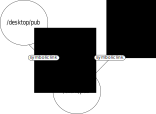

<html>
<head></head>
<body>
<h1>Welcome to the Business End of the Project</h1>
<h2>File structures and Workflow</h1>

We use a three-directory structure for all parts of this project (Client, Server, and Desktop).  You will see that reflected in the directory that contains this README file.  These directories are defined as follows:  

<h3>The /dev Directory</h3>

The /dev directory holds things we developers use that don't go into the final publication of the app.  Among other things, it has a "brepl" script to run a browser repl, and a "build" script to compile the contents of the /src directory into the pub/js directory.  Run these scripts from the root directory, e.g. ./dev/build.
  

What I usually do, when I am writing code for the Client, is I first start a browser repl, as described <a href="https://github.com/tecumsehcommunications/StarlinkViewer/tree/master/repls#the-client-browser-repl">here</a>.  Then I open either the scratch-paper file found in /dev/scratch.cljs or a source file found in /src into an Emacs buffer and go to work.  Once I am satisfied with how the code works in the repl, I run /dev/build which compiles everything in /src into /pub/js for the browser to load with the page.

<h3>The /pub Directory </h3>

This directory is shared between all three branches of the project (client, server, desktop) as follows:

</img>

Work done in other areas of the project ultimately gets published to this directory where it is picked up by the server and sent to a browser.  Browser ready blender scenes are exported from the Desktop to the /scn sub directory.  Image and SVG files usually come in via Inkscape and Gimp, which also can be installed on the Desktop.  Other directories will be added as needed

This client side of the project is the final staging grounds for work done elsewhere.  It also is for developing all the client side code to run in the browser.  

See the <a href="https://github.com/tecumsehcommunications/StarlinkViewer/tree/master/server">server</a> and <a href="https://github.com/tecumsehcommunications/StarlinkViewer/tree/master/desktop">desktop</a> branches of this project to see how they each publish to this directory.

<h4>Using LiveReload</h4>

I use Emacs to edit all the HTML, CSS, and SVG files in the /pub directory.  When I am doing this, I also run a LiveReload process on the /pub directory from the Server.  The instructions for doing that are <a href="">here</a>. Then, after installing a LiveReload plugin for your browser like the one found <a href="https://chrome.google.com/webstore/detail/livereload/jnihajbhpnppcggbcgedagnkighmdlei?hl=en">here</a>, all you need to do is point your web browser to the http://localhost URL on your machine and activate the plugin. Now, whenever you edit any file in the/pub directory in Emacs, when you "C-x C-s" in its Emacs buffer, that file saves and the web page automatically reloads it. This really speeds development of the HTML scaffolding of the app. 
 

<h3>The /src Directory </h3>

The challenge is to bring a 3D scene created in Blender, place a camera in that scene corresponding to the actual latitude and longitude coordinates reported by the browser, and then align, position and configure that camera to match the physical camera on the host device.

The browser must also retrieve satellite orbital data from the server and then construct and animate satellite orbital animations in the 3D scene as they should appear to the camera.  To get a sense of the math involved checkout <a "href=https://www.amsat.org/keplerian-elements-tutorial/">here</a> and <a href="https://github.com/tecumsehcommunications/StarlinkViewer/tree/master/client/dev">here</a>
 

 
A person using this app accurately will be able to see where Starlink satellites are passing overhead and if they can be reached from his location.  A real Starlink Viewer.  Saddle up, nerds.

<h2>A Word about Three.js</h2>

You probably want to clone the entirety of the three.js project from github, at https://github.com/mrdoob/three.js.git, 
to keep it handy on your machine. Even though we'll just be using a fraction of the utility in that project to start, we'll likely 
use a lot more as things progress.
  

For now, for the client side of the app, all that is needed is the three.min.js file found in the build directory of the three.js 
project.  It is small enough that I include it in this project's repository where the client app is setup to automatically load it with 
the webpage. So there really is no initial setup to do for Three.js as long as you have a cloned copy of this project into a local folder.

We need Three.js on the tool chain for two principal reasons, right now.  1)  It can load the .gltf scene file we export out of Blender from its place on the Server into a webGL canvas of the Client/Broswer side of our application, and 2) It can render that scene on that canvas with all its lights, textures, animations, .etc —just as they were built in Blender. 
 

Thanks to Mr. Doob and the Three.js development community.
  

<h2>Time to Jump</h2>

Developing the Client Provides Some Iteresting Challenges.  Learn about them <a href="https://github.com/tecumsehcommunications/StarlinkViewer/blob/master/client/dev/README.md">here</a>.

  
</body>
</html>
