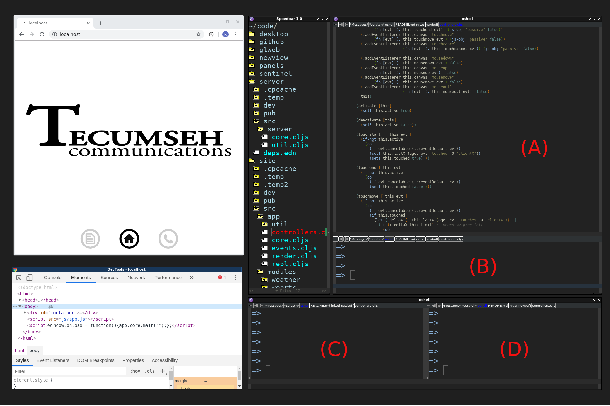

I use lisp syntax for coding because it helps me get my ideas out the quickest.  I don't think I am alone with that sentiment.

Lisp leads you to Emacs and Clojure and Hy, which are 1) The Ultimate Lisp programming environment, 2) a brilliant fusion of Clojure Lisp and Google's javascript development tools and libraries, and 3) The Industry's implementation of Lisp syntax for the Python language.

I install Clojure-mode for all my lisp programming in Emacs.  And I add: 

<pre><code>add-to-list 'auto-mode-alist '("\\.hy\\'" . clojure-mode))</code></pre>

to my .emacs.d/init.el file so that clojure-mode envokes on .hy (hy files) as well. 

I also add the contents of the eLisp snippet in this folder.  The idea there is pretty straight forward: You "C-u M-x: shell" in Emacs and give the buffer a name you have pre-designated to emacs as a buffer you will be sending lisp commands to.  So for example, in the snippet I refer to, there is a line that says:

  <pre><code>(define-key clojure-mode-map (kbd "C-w")
      (lambda () (interactive) (repl-eval-last-expression "brepl")))</pre></code>
  

What that means is if you do "C-u M-x: shell,"  name the buffer "brepl" and then start a browser-connected repl like the Clojure development tools provide, when you open a .cljs file into another emacs buffer, you can send clojurescript lisp commands from that buffer to an application running in a browser or nodejs just by doing a "C-w" keystroke. 

This basic ability multiplies in utility as development becomes more complex.  For example, consider the following screenshot.

</img>

From window A, we can direct commands into any of three availablerepl environements (B, C, D) which could simultaneously be running a node.js server, linked to a running browser, or linked to a blender/python dataset.  As you learn to work with more tools on the chain, this flexibility will be very useful.

So also add the snippet.el file in this folder to your emacs init.el file and get familiar working with hy/node/clojurescript, etc. repls as you need like.

Footnote:

<pre><code>With particular respect and gratitude to James Gosling (creator of Emacs), Rich Hickey (Creator of Clojure), and the Hy Society.</code></pre>

